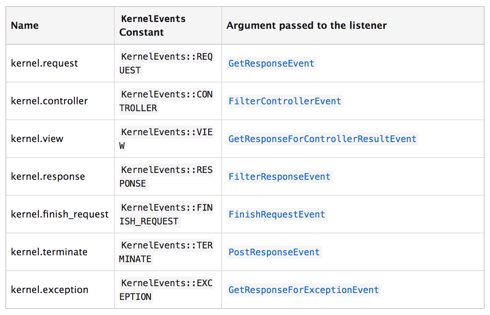

Eventos del Kernel
==================

Durante el procesamiento de una petición HTTP, el framework Symfony (o cualquier aplicación que utilice el componente HttpKernel) genera varios eventos que se pueden utilizar para modificar cómo se procesa la request.

La clase KernelEvent
--------------------

Cada evento generado por el componente HttpKernel es una subclase de la clase KernelEvent
Each event dispatched by the HttpKernel component is a subclass of KernelEvent, la cual proporciona la siguiente información:

- getRequestType(): 
Devuelve el tipo de petición (HttpKernelInterface::MASTER_REQUEST o HttpKernelInterface::SUB_REQUEST). Una subrequest es una request realizada desde twig mediante **reder(controller())**.
- getKernel()
Devuelve el objeto Kernel que está manejando la request.
- getRequest()
Devuelve el objeto request actual.

Lista de eventos del Kernel
---------------------------

### kernel.request

Event Class: GetResponseEvent

Este evento se genera antes de determinar qué controlador se va a utilizar para procesar la petición. Es útil para añadir información a la request o para devolver una Response rápida saltándo el flujo normal del framework.

Con el siguiente comando podemos ver todos los listeners suscritos a este evento:

> bin/console debug:event-dispatcher kernel.request

### kernel.controller

Event Class: FilterControllerEvent

Este evento se genera después de que se resuelva cuál es el controlador asociado a la petición, pero antes de ejectuar dicho controlador. Se puede utilizar, por ejemplo para añadir datos necesarios para el controlador o incluso para cambiar el controlador que se va a ejecutar.

Con el siguiente comando podemos ver todos los listeners suscritos a este evento:

> bin/console debug:event-dispatcher kernel.controller

### kernel.view

Event Class: GetResponseForControllerResultEvent

Este evento se genera después de que el controlador haya sido ejecutado pero únicamente si no ha devuelto un objeto Response. Es útil para transformar el valor retornado por el controlador en un objeto Response.

Con el siguiente comando podemos ver todos los listeners suscritos a este evento:

> bin/console debug:event-dispatcher kernel.view

### kernel.response

Event Class: FilterResponseEvent

Este evento se genera después de que el controlador o un listener de kernel.view hayan devuelto un objeto Response. Es útil para modificar la respuesta (por ejemplo añadir cabeceras http, añadir cookies...).

Con el siguiente comando podemos ver todos los listeners suscritos a este evento:

> bin/console debug:event-dispatcher kernel.response

### kernel.finish_request

Event Class: FinishRequestEvent

Este evento se genera después de que una subrequest haya terminado. Es útil para restablecer valores globales de la aplicación. Por ejemplo, el listener de traducciones resetea el parámetro *locale* al valor que tenía la request padre.

Con el siguiente comando podemos ver todos los listeners suscritos a este evento:

> bin/console debug:event-dispatcher kernel.finish_request

### kernel.terminate

Event Class: PostResponseEvent

Este evento se genera después de que la respuesta haya sido enviada. Es útil para realizar tareas complejas y/o lentas que no necesitan estar terminadas para mandar la respuesta (por ejemplo, enviar emails).

Con el siguiente comando podemos ver todos los listeners suscritos a este evento:

> bin/console debug:event-dispatcher kernel.terminate

### kernel.exception

Event Class: GetResponseForExceptionEvent

Este evento se genera tan pronto como ocurre un error. Es útil para modificar la información de la excepción que se envía en la respuesta.

Con el siguiente comando podemos ver todos los listeners suscritos a este evento:

> bin/console debug:event-dispatcher kernel.exception

Resumen de eventos del Kernel
-----------------------------

En esta imagen podemos ver un resumen de los eventos del Kernel:

