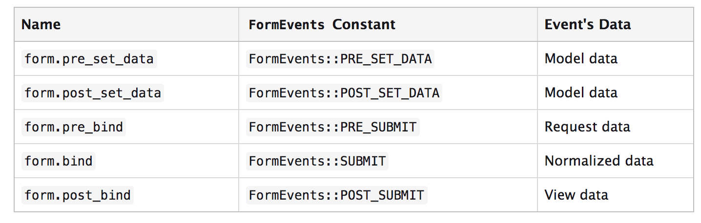

Eventos de Formulario
=====================

El componente de formularios provee de un proceso estructurado que permite personalizar los formularios a través del EventDispatcher, es decir, a través de eventos.

La siguiente tabla muestra la lista de eventos generados por los formularios en el orden en que son generados:

En los siguientes vídeos, vamos a utilizar estos eventos para programar formularios dinámicos.

